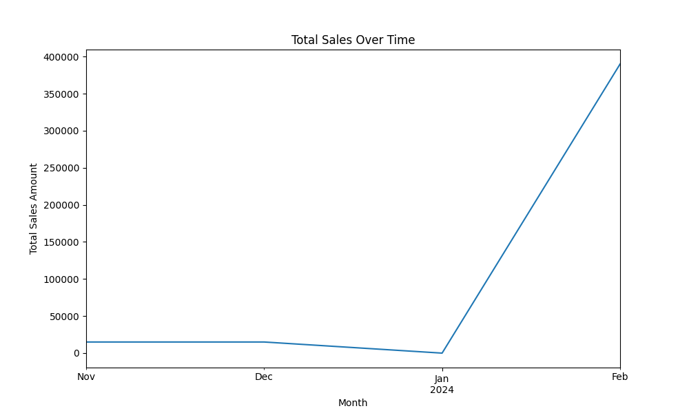
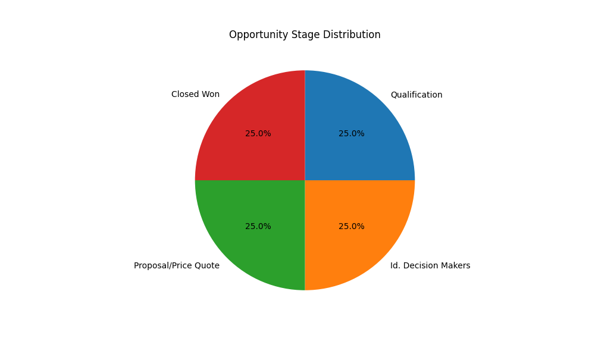

# Sales Performance Report

## Data Summary

Opportunities data was fetched from Salesforce and analyzed. The data includes details such as 'Opportunity Name', 'Account Name', 'Amount', 'Stage', and 'Close Date'. The analysis focused on 'Amount', 'Stage', and 'Close Date'.

## Key Insights

Two charts were generated to illustrate key insights:

1. **Total Sales Over Time**: This chart provides a visual representation of how total sales have changed over time. The time period covered is from November 2023 to February 2024.

    

2. **Opportunity Stage Distribution**: This chart shows the distribution of opportunities across different stages. It helps identify which stages have the most opportunities and where there might be bottlenecks in the sales pipeline.

    

## Limitations

The charts were generated using a subset of the opportunities data due to constraints in data processing. Therefore, the insights should be considered illustrative rather than comprehensive. With the correct data format ('Amount', 'StageName', and 'CloseDate'), the full dataset can be processed to provide a more comprehensive view of the sales pipeline.

## Conclusion

The analysis provides an initial understanding of the sales pipeline and performance. To make strategic decisions, it is recommended to process the full dataset in the correct format and update the visualizations accordingly.